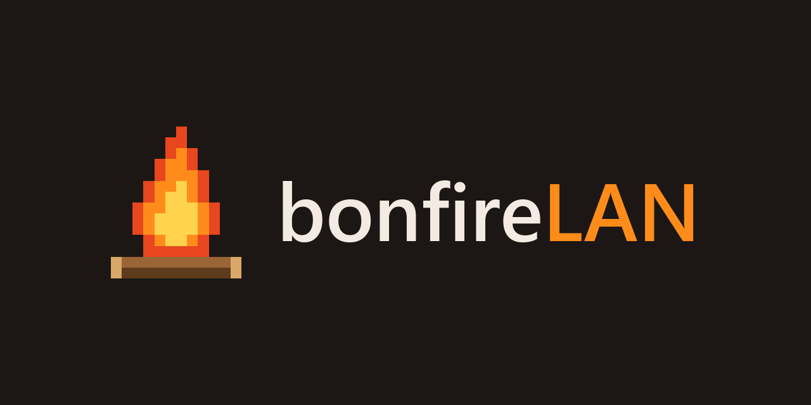

<p align="center"></p>

A Fabric-based launcher for playing Minecraft (no Minecraft installation nedeed!) over LAN with your friends. Open it, the server shows up, hit Play and you're in. Java, Minecraft, Fabric and the server's mods download on their own. 

**Windows only.** Both the launcher and the host script. No Mac or Linux for now.

## Playing

1. Grab the installer from [Releases](../../releases/latest) (or the portable exe if you don't want to install anything).
2. Install it. If Windows says "Windows protected your PC", click **More info → Run anyway**. It's just because the exe isn't signed.
3. Open it.

## Hosting

Set `online-mode=false` in `server.properties`.

Vanilla works fine, nothing required to do.

If it has mods, download [`bonfirelan-server.ps1`](server-tools/bonfirelan-server.ps1), leave it in Downloads, open PowerShell and paste this with your server's path:

```powershell
powershell -ExecutionPolicy Bypass -File "$HOME\Downloads\bonfirelan-server.ps1" -ServerDir "C:\path\to\your\server"
```

Keep that window open while you play, it's what hands the mods to everyone else. The first time, Windows asks about the firewall: tick **Private networks** and allow it.

If you change the server's mods, the script picks it up by itself, no need to restart it.

## If something's off

- **Server doesn't show up:** make sure you're all on the same network. If it still doesn't, add it with the host's IP at the bottom.
- **You get in but without mods:** the host isn't running the script, or didn't allow it through the firewall.
- **You get kicked when joining:** `online-mode` is set to `true`.

## Why this exists

My friends and I do LANs all the time to play different Minecraft modes, and most nights took forever to get going because nobody installed anything until the very last minute. So I made this.

Don't take it too seriously lol. If you need something different, just fork it and bend it to whatever you need. And if it helps with your own LANs with friends, awesome!

## Development

You need [Node](https://nodejs.org/) 20+, [Rust](https://www.rust-lang.org/tools/install) and the [Tauri prerequisites](https://tauri.app/start/prerequisites/) (on Windows, Visual Studio Build Tools with C++).

```bash
npm install
npm run tauri dev     # the app with hot reload
npm run tauri build   # builds the installer into src-tauri/target/release/bundle/
```

UI lives in `src/` (React + Tailwind), the core in `src-tauri/` (Rust) and the host script in `server-tools/`.

## License

MIT, do whatever you want with it.
